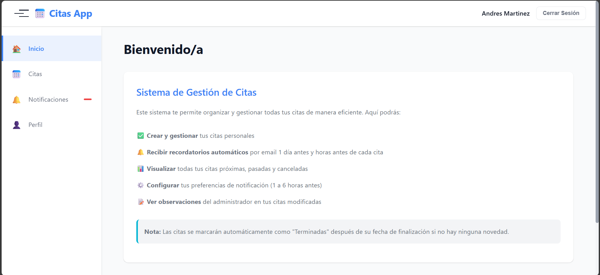
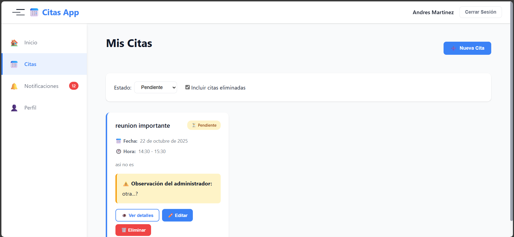
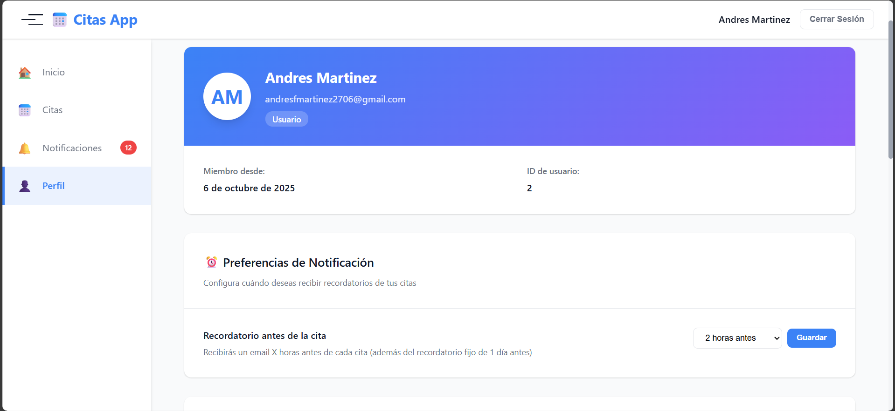

# 📅 **Proyecto entornos - Aplicacion de Citas**

Este proyecto implementa el **backend y frontend de un sistema de gestión de citas** con autenticación JWT, roles (admin y usuario), validación de horarios, notificaciones automáticas y envío de correos electrónicos.

## 🤝🏻 **Integrantes**

* Andres Felipe Martinez
* Harold Esteban Duran
* Luige Alejandro Velasco

## 💾 **Imagen del esquma inicial de la Base de Datos**


---

# 📅 Sistema de Gestión de Citas

Sistema web completo para la gestión y programación de citas con notificaciones automáticas por email. Permite a los usuarios crear, modificar y eliminar citas, mientras que los administradores pueden gestionar todas las citas del sistema.

## 🌟 Características Principales

- ✅ **Autenticación JWT** - Sistema seguro de login y registro
- 📅 **Gestión de Citas** - CRUD completo con soft-delete
- 🔔 **Notificaciones Automáticas** - Recordatorios configurables (1 día antes + X horas antes)
- 👥 **Roles de Usuario** - Diferenciación entre usuarios normales y administradores
- 📧 **Emails Automáticos** - Plantillas HTML para confirmaciones y recordatorios
- 📊 **Panel Admin** - Estadísticas y gestión global del sistema
- 🎨 **Interfaz Moderna** - Diseño responsive con sidebar desplegable
- ⚙️ **Configuración Personalizada** - Usuarios pueden ajustar preferencias de notificación

## 📋 Tabla de Contenidos

- [📅 **Proyecto entornos - Aplicacion de Citas**](#-proyecto-entornos---aplicacion-de-citas)
  - [🤝🏻 **Integrantes**](#-integrantes)
  - [💾 **Imagen del esquma inicial de la Base de Datos**](#-imagen-del-esquma-inicial-de-la-base-de-datos)
- [📅 Sistema de Gestión de Citas](#-sistema-de-gestión-de-citas)
  - [🌟 Características Principales](#-características-principales)
  - [📋 Tabla de Contenidos](#-tabla-de-contenidos)
  - [🛠️ Tecnologías Utilizadas](#️-tecnologías-utilizadas)
    - [Backend](#backend)
    - [Frontend](#frontend)
    - [Base de Datos](#base-de-datos)
  - [📦 Requisitos Previos](#-requisitos-previos)
  - [📁 Estructura del Proyecto](#-estructura-del-proyecto)
  - [📖 Documentación Detallada](#-documentación-detallada)
  - [🎯 Uso](#-uso)
    - [Para Usuarios](#para-usuarios)
    - [Para Administradores](#para-administradores)
  - [🔌 API Endpoints](#-api-endpoints)
    - [Autenticación](#autenticación)
    - [Usuarios](#usuarios)
    - [Citas](#citas)
    - [Notificaciones](#notificaciones)
  - [🔒 Seguridad](#-seguridad)
  - [🎨 Capturas de Pantalla](#-capturas-de-pantalla)
  - [🧠 **Créditos**](#-créditos)

## 🛠️ Tecnologías Utilizadas

### Backend
- **Java 17** - Lenguaje de programación
- **Spring Boot 3.5.6** - Framework principal
- **Spring Security** - Autenticación y autorización
- **JWT (jsonwebtoken 0.11.5)** - Tokens de sesión
- **PostgreSQL** - Base de datos
- **JPA/Hibernate** - ORM
- **JavaMail** - Envío de correos
- **Thymeleaf** - Motor de plantillas para emails
- **Maven** - Gestión de dependencias

### Frontend
- **HTML5** - Estructura
- **CSS3** - Estilos (sistema de variables CSS)
- **JavaScript (Vanilla)** - Lógica del cliente
- **Fetch API** - Peticiones HTTP

### Base de Datos
- **PostgreSQL** (Neon.tech) - Base de datos cloud

## 📦 Requisitos Previos

- **Java 17** o superior
- **Maven 3.6+**
- **PostgreSQL** (o acceso a Neon.tech)
- **Node.js** (opcional, para servir el frontend)
- **Live Server** (VSCode) o cualquier servidor HTTP estático

## 📁 Estructura del Proyecto

```
appointments-system/
├── appointments_backend/          # Backend Spring Boot
│   ├── src/
│   │   ├── main/
│   │   │   ├── java/
│   │   │   │   └── uis/edu/co/appointments/
│   │   │   │       ├── controller/      # Controladores REST
│   │   │   │       ├── models/          # Entidades JPA
│   │   │   │       ├── repository/      # Repositorios
│   │   │   │       ├── service/         # Lógica de negocio
│   │   │   │       ├── security/        # Configuración JWT
│   │   │   │       └── dto/             # Data Transfer Objects
│   │   │   └── resources/
│   │   │       ├── application.properties
│   │   │       └── templates/           # Plantillas email
│   │   └── test/
│   ├── pom.xml
│   └── README.md                  # 📖 Documentación backend
│
├── appointments_frontend/         # Frontend HTML/CSS/JS
│   ├── index.html                 # Landing + Login/Register
│   ├── home.html                  # Dashboard principal
│   ├── appointments.html          # Gestión de citas
│   ├── notifications.html         # Notificaciones
│   ├── profile.html               # Perfil de usuario
│   ├── css/
│   │   └── styles.css            # Estilos completos
│   ├── js/
│   │   ├── api.js                # Cliente API REST
│   │   ├── auth.js               # Autenticación
│   │   ├── ui.js                 # Utilidades UI
│   │   ├── appointments.js       # Lógica de citas
│   │   ├── notifications.js      # Lógica de notificaciones
│   │   └── profile.js            # Lógica de perfil
│   └── README.md                 # 📖 Documentación frontend
│
└── README.md                     # Este archivo
```

## 📖 Documentación Detallada

Para información detallada sobre cada componente:

- **[📘 Documentación del Backend](./appointments_backend/README.md)** - Arquitectura, endpoints, modelos de datos
- **[📗 Documentación del Frontend](./appointments_frontend/README.md)** - Estructura, componentes, flujos de usuario

## 🎯 Uso

### Para Usuarios

1. **Registro**: Crear cuenta con nombre, email y contraseña
2. **Login**: Iniciar sesión con credenciales
3. **Crear Citas**: Programar citas con fecha, hora y descripción
4. **Recibir Notificaciones**: 
   - Email 1 día antes (9:00 AM)
   - Email X horas antes (configurable 1-6 horas)
5. **Gestionar Citas**: Editar o eliminar citas propias
6. **Configurar Perfil**: Cambiar email, contraseña y preferencias

### Para Administradores

1. **Vista Global**: Ver todas las citas del sistema
2. **Gestión de Citas**: Modificar/eliminar cualquier cita
3. **Observaciones**: Agregar notas al modificar citas de usuarios
4. **Estadísticas**: Dashboard con métricas del sistema
5. **Notificaciones**: Sistema automático notifica a usuarios sobre cambios

## 🔌 API Endpoints

### Autenticación
```
POST   /auth/login         - Iniciar sesión
POST   /auth/register      - Registrar usuario
```

### Usuarios
```
GET    /api/users/me              - Perfil actual
PATCH  /api/users/{id}/email      - Cambiar email
PATCH  /api/users/{id}/password   - Cambiar contraseña
PATCH  /api/users/{id}/notification-preference - Configurar notificaciones
```

### Citas
```
GET    /api/appointments                  - Listar citas
GET    /api/appointments/upcoming         - Citas próximas (7 días)
GET    /api/appointments/{id}             - Detalle de cita
POST   /api/appointments                  - Crear cita
PUT    /api/appointments/{id}             - Editar cita
PUT    /api/appointments/{id}/admin       - Editar como admin (con observación)
DELETE /api/appointments/{id}             - Eliminar cita
DELETE /api/appointments/{id}/admin       - Eliminar como admin (con observación)
```

### Notificaciones
```
GET    /api/notifications/me              - Mis notificaciones
GET    /api/notifications/me/unread-count - Contador no leídas
PATCH  /api/notifications/{id}/read       - Marcar como leída
PATCH  /api/notifications/me/read-all     - Marcar todas como leídas
DELETE /api/notifications/{id}            - Eliminar notificación
```

Ver documentación completa de endpoints en [Backend README](./appointments_backend/README.md)

## 🔒 Seguridad

- **JWT**: Autenticación basada en tokens
- **BCrypt**: Hash de contraseñas
- **CORS**: Configurado para orígenes permitidos
- **Validación**: Validación de datos en backend y frontend
- **XSS Protection**: Escapado de HTML en frontend

## 🎨 Capturas de Pantalla





---

## 🧠 **Créditos**

Desarrollado bajo la guía del profesor **Carlos Adolfo Beltran castro — UIS**

Proyecto académico — Universidad Industrial de Santander 🟢
