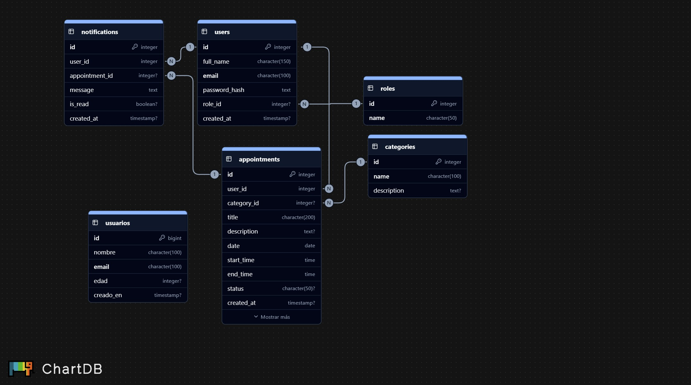
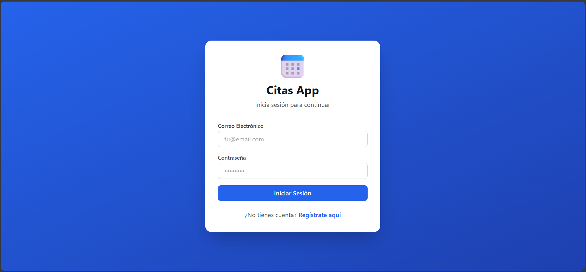
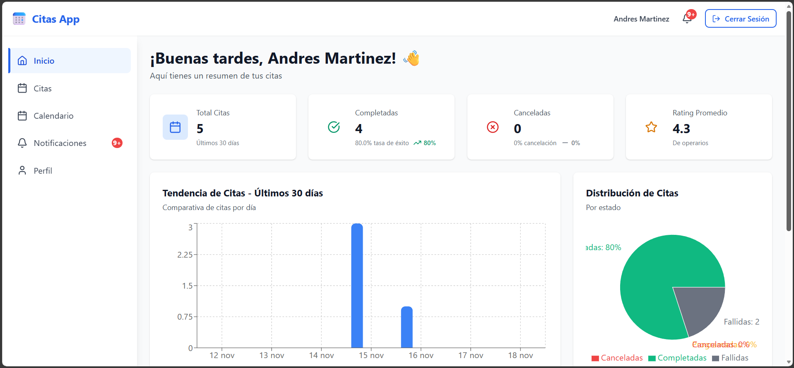
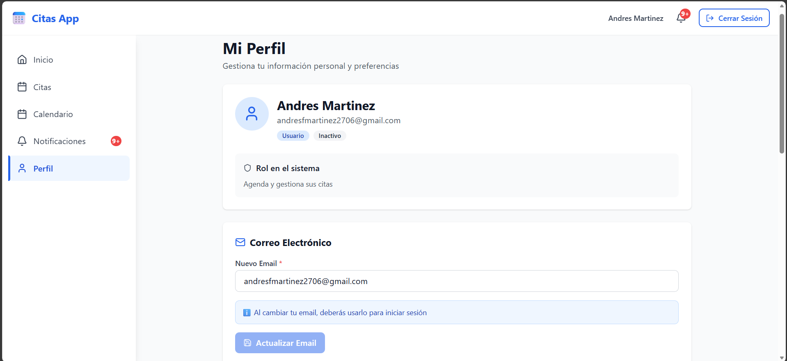

# 📅 **Proyecto Entornos - Aplicación de Citas**

Sistema web completo para la gestión y programación de citas con autenticación JWT, notificaciones automáticas, sistema de calificaciones y roles diferenciados (Admin, Operario, Usuario).

## 🤝🏻 **Integrantes**

* Andres Felipe Martinez
* Harold Esteban Duran
* Luige Alejandro Velasco

## 💾 **Base de Datos**



---

## 🌟 Características Principales

- ✅ **Autenticación JWT** - Sistema seguro de login y registro
- 👥 **Sistema de Roles** - Admin, Operario y Usuario con permisos específicos
- 📅 **Gestión Completa de Citas** - CRUD con validaciones y asignación automática
- ⏰ **Horarios de Operarios** - Definición de disponibilidad semanal
- 🔔 **Notificaciones Inteligentes** - Recordatorios personalizables (1 día + X horas antes)
- 📧 **Emails HTML Automáticos** - Plantillas Thymeleaf profesionales
- ⭐ **Sistema de Calificaciones** - Usuarios califican operarios y viceversa
- 📊 **Dashboard Avanzado** - Estadísticas con filtros temporales y gráficos
- 📆 **Calendario Visual** - Integración con React Big Calendar
- 📂 **Categorías de Servicio** - Duraciones configurables por categoría
- 🎨 **Interfaz Moderna React** - UI responsive con Tailwind CSS

## 📋 Tabla de Contenidos

- [🛠️ Tecnologías Utilizadas](#️-tecnologías-utilizadas)
- [📦 Requisitos Previos](#-requisitos-previos)
- [📁 Estructura del Proyecto](#-estructura-del-proyecto)
- [🚀 Instalación y Configuración](#-instalación-y-configuración)
- [📖 Documentación Detallada](#-documentación-detallada)
- [🎯 Uso por Rol](#-uso-por-rol)
- [🔌 API Endpoints](#-api-endpoints)
- [🔒 Seguridad](#-seguridad)
- [🎨 Capturas de Pantalla](#-capturas-de-pantalla)
- [🧠 Créditos](#-créditos)

## 🛠️ Tecnologías Utilizadas

### Backend
- **Java 17** - Lenguaje de programación
- **Spring Boot 3.5.6** - Framework principal
- **Spring Security** - Autenticación y autorización
- **JWT (jjwt 0.11.5)** - Tokens de sesión
- **PostgreSQL** - Base de datos
- **JPA/Hibernate** - ORM
- **JavaMail** - Envío de correos
- **Thymeleaf** - Motor de plantillas HTML
- **Maven** - Gestión de dependencias

### Frontend React
- **React 18** - Biblioteca principal
- **Vite** - Build tool y dev server
- **React Router DOM** - Navegación SPA
- **Axios** - Cliente HTTP
- **Tailwind CSS** - Framework CSS
- **Lucide React** - Iconos modernos
- **React Big Calendar** - Calendario interactivo
- **Recharts** - Gráficos y estadísticas
- **Sonner** - Notificaciones toast
- **React Hook Form** - Manejo de formularios
- **Moment.js** - Manejo de fechas

### Frontend Legacy (HTML/CSS/JS)
- **HTML5, CSS3, JavaScript Vanilla**
- **Fetch API** - Peticiones HTTP
- Disponible en carpeta `appointments_frontend`

### Base de Datos
- **PostgreSQL** (Neon.tech) - Base de datos cloud

## 📦 Requisitos Previos

### Backend
- **Java 17** o superior
- **Maven 3.6+**
- **PostgreSQL** (o acceso a Neon.tech)

### Frontend React
- **Node.js 18+**
- **npm** o **yarn**

## 📁 Estructura del Proyecto

```
appointments-system/
├── appointments_backend/              # Backend Spring Boot
│   ├── src/
│   │   ├── main/
│   │   │   ├── java/uis/edu/co/appointments/
│   │   │   │   ├── controller/       # Endpoints REST
│   │   │   │   ├── models/           # Entidades JPA
│   │   │   │   ├── repository/       # Repositorios
│   │   │   │   ├── service/          # Lógica de negocio
│   │   │   │   ├── security/         # JWT y seguridad
│   │   │   │   ├── dto/              # Data Transfer Objects
│   │   │   │   └── util/             # Utilidades
│   │   │   └── resources/
│   │   │       ├── application.properties
│   │   │       └── templates/        # Plantillas email HTML
│   │   └── test/
│   ├── pom.xml
│   └── README.md                      # 📘 Documentación backend
│
├── appointments_frontend_react/       # Frontend React (Principal)
│   ├── src/
│   │   ├── api/                      # Servicios de API
│   │   ├── components/               # Componentes reutilizables
│   │   │   ├── common/              # Botones, modales, cards
│   │   │   ├── appointments/        # Componentes de citas
│   │   │   ├── forms/               # Formularios
│   │   │   ├── layout/              # Layout y navegación
│   │   │   ├── notifications/       # Sistema de notificaciones
│   │   │   └── stats/               # Estadísticas y gráficos
│   │   ├── context/                 # Context API (Auth, Notif)
│   │   ├── hooks/                   # Custom Hooks
│   │   ├── pages/                   # Páginas/Vistas
│   │   ├── utils/                   # Utilidades
│   │   ├── App.jsx
│   │   └── main.jsx
│   ├── package.json
│   ├── tailwind.config.js
│   └── README.md                     # 📗 Documentación frontend React
│
├── appointments_frontend/             # Frontend Legacy (HTML/CSS/JS)
│   ├── index.html
│   ├── home.html
│   ├── appointments.html
│   ├── notifications.html
│   ├── profile.html
│   ├── css/styles.css
│   └── js/
│       ├── api.js
│       ├── auth.js
│       └── ...
│
└── README.md                         # Este archivo
```

## 📖 Documentación Detallada

Consulta la documentación completa de cada módulo:

- **[📘 Backend - Spring Boot](./appointments_backend/README.md)**
  - Arquitectura completa
  - Modelo de datos (8 tablas)
  - API Endpoints (40+ endpoints)
  - Servicios y lógica de negocio
  - Sistema de notificaciones
  - Configuración JWT y SMTP
  - Tareas programadas

- **[📗 Frontend - React](./appointments_frontend_react/README.md)**
  - Estructura de componentes
  - Contextos y hooks
  - Rutas y navegación
  - Sistema de notificaciones
  - Gestión de estado
  - Componentes reutilizables

## 🎯 Uso por Rol

### 👤 USUARIO
- ✅ Registrarse e iniciar sesión
- ✅ Crear citas con selección manual o automática de operario
- ✅ Ver y gestionar sus propias citas
- ✅ Cancelar citas programadas
- ✅ Recibir notificaciones (email + in-app)
- ✅ Calificar operarios (1-5 estrellas)
- ✅ Configurar preferencias de notificación
- ✅ Ver estadísticas personales
- ✅ Gestionar perfil (email, contraseña)

### 👷 OPERARIO
- ✅ Ver citas asignadas
- ✅ Completar citas con observaciones
- ✅ Calificar usuarios (asistencia y desempeño)
- ✅ Gestionar horarios laborales semanales
- ✅ Ver estadísticas de rendimiento
- ✅ Recibir notificaciones de asignación
- ✅ Ver citas pendientes de completar
- ❌ No puede crear ni cancelar citas

### 👨‍💼 ADMIN
- ✅ Acceso completo a todas las funcionalidades
- ✅ Gestionar usuarios (crear, editar, desactivar)
- ✅ Crear operarios y asignar categorías
- ✅ CRUD de categorías de servicio
- ✅ Configurar duraciones permitidas por categoría
- ✅ Ver todas las citas del sistema
- ✅ Modificar/cancelar cualquier cita
- ✅ Dashboard con estadísticas globales
- ✅ Filtros avanzados de búsqueda
- ✅ Cambiar roles de usuarios

## 🔌 API Endpoints

### Principales Categorías

#### 🔐 Autenticación
```
POST   /auth/login          - Iniciar sesión (JWT)
POST   /auth/register       - Registro de usuario
```

#### 👤 Usuarios
```
GET    /api/users/me                         - Perfil actual
GET    /api/users                            - Listar usuarios (ADMIN)
GET    /api/users/operators                  - Operarios activos
POST   /api/users/create-operator            - Crear operario (ADMIN)
PATCH  /api/users/{id}/categories            - Asignar categorías (ADMIN)
PATCH  /api/users/{id}/notification-preferences - Configurar notifs
```

#### 📅 Citas
```
GET    /api/appointments                      - Listar citas (filtradas por rol)
GET    /api/appointments/upcoming             - Citas próximas (7 días)
GET    /api/appointments/available-operators  - Buscar operarios disponibles
POST   /api/appointments                      - Crear cita
PUT    /api/appointments/{id}                 - Actualizar cita
DELETE /api/appointments/{id}                 - Cancelar cita (soft-delete)
POST   /api/appointments/{id}/complete        - Completar cita (OPERARIO)
PATCH  /api/appointments/{id}/rate-operator   - Calificar operario (USUARIO)
GET    /api/appointments/dashboard/stats      - Estadísticas dashboard
```

#### 🔔 Notificaciones
```
GET    /api/notifications/me              - Mis notificaciones
GET    /api/notifications/me/unread-count - Contador no leídas
PATCH  /api/notifications/{id}/read       - Marcar como leída
PATCH  /api/notifications/me/read-all     - Marcar todas leídas
DELETE /api/notifications/{id}            - Eliminar notificación
```

#### 📂 Categorías
```
GET    /api/categories                    - Listar categorías
POST   /api/categories                    - Crear categoría (ADMIN)
PUT    /api/categories/{id}               - Actualizar categoría (ADMIN)
DELETE /api/categories/{id}               - Eliminar categoría (ADMIN)
PATCH  /api/categories/{id}/durations     - Actualizar duraciones (ADMIN)
```

#### ⏰ Horarios de Operarios
```
GET    /api/operator-schedules/me                    - Mis horarios (OPERARIO)
GET    /api/operator-schedules/operator/{id}         - Horarios de operario
POST   /api/operator-schedules                       - Crear horario (OPERARIO)
PUT    /api/operator-schedules/{id}                  - Actualizar horario (OPERARIO)
DELETE /api/operator-schedules/{id}                  - Eliminar horario (OPERARIO)
GET    /api/operator-schedules/availability/{id}/{day} - Verificar disponibilidad
```

Ver documentación completa en [Backend README](./appointments_backend/README.md#-api-endpoints-detallados)

## 🔒 Seguridad

### Autenticación
- **JWT** con HS256 (HMAC-SHA256)
- Tokens con expiración configurable (1 hora default)
- Claims: `id`, `role`, `name`, `email`
- Refresh automático en frontend

### Autorización
- Control basado en roles (`@PreAuthorize`)
- Validación a nivel de servicio
- Rutas protegidas en frontend

### Protección de Datos
- **BCrypt** para contraseñas (10 rondas)
- **CORS** configurado para orígenes permitidos
- **XSS Protection** en sanitización de inputs
- Validación en backend y frontend
- Soft-delete para preservar integridad

### Configuración SMTP Segura
- Contraseñas de aplicación de Gmail
- Variables de entorno para credenciales
- TLS/STARTTLS habilitado

## 🎨 Capturas de Pantalla

### Login


## Inicio


### Citas


### Perfil de Usuario


---

## 🔄 Flujos Principales del Sistema

### 1. Creación de Cita con Asignación Automática
1. Usuario selecciona categoría, fecha, hora y duración
2. Sistema busca operarios disponibles con esa categoría
3. Verifica horarios laborales del operario
4. Valida solapamientos con otras citas
5. Asigna operario disponible automáticamente
6. Programa notificaciones (1 día antes + X horas antes)
7. Envía emails de confirmación a usuario y operario

### 2. Sistema de Notificaciones Automatizado
- **Scheduler cada 10 minutos**: Envía notificaciones pendientes
- **Recordatorio 1 día antes**: Email a las 9:00 AM
- **Recordatorio X horas antes**: Según preferencia del usuario (1-6h)
- **Respeta preferencias**: Solo envía si el usuario lo permite
- **Auto-completado**: Citas pasadas se completan automáticamente cada hora

### 3. Completar Cita (Flujo Operario)
1. Operario marca cita como completada
2. Indica si el usuario asistió o no
3. Agrega observaciones
4. Califica al usuario (1-5 estrellas)
5. Sistema actualiza estadísticas del usuario
6. Envía notificación in-app al usuario

### 4. Sistema de Calificaciones
- Usuarios califican operarios después de citas completadas
- Operarios califican usuarios al completar citas
- Promedios se calculan automáticamente
- Notificaciones de calificaciones recibidas

---

## 🧠 **Créditos**

Desarrollado bajo la guía del profesor **Carlos Adolfo Beltrán Castro — UIS**

Proyecto académico — Universidad Industrial de Santander 🟢

---

**📚 Para más información técnica, consulta:**
- [Backend README](./appointments_backend/README.md) - Documentación técnica completa del API
- [Frontend React README](./appointments_frontend_react/README.md) - Documentación de componentes y arquitectura