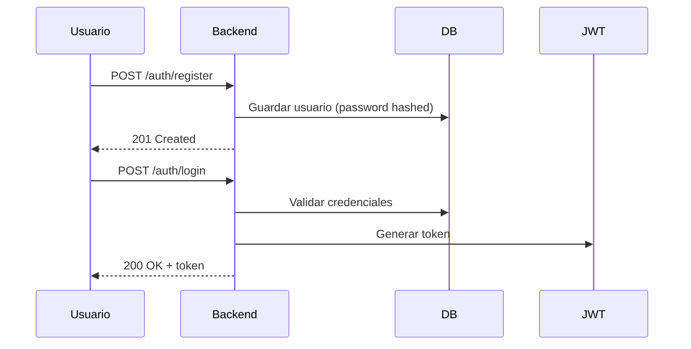
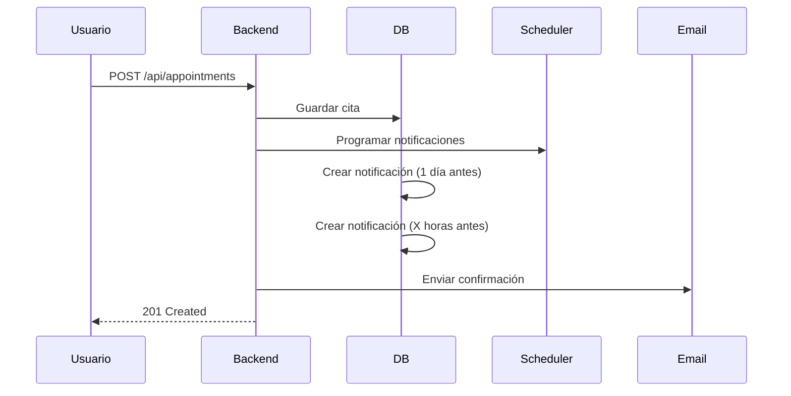
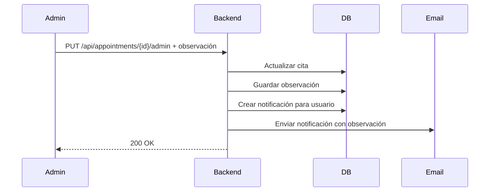

# 📘 Backend - Sistema de Gestión de Citas

API REST desarrollada con Spring Boot para la gestión de citas con autenticación JWT, notificaciones automáticas y emails.

## 🏗️ Arquitectura

```
appointments_backend/
├── src/main/java/uis/edu/co/appointments/
│   ├── controller/          # Endpoints REST
│   │   ├── AuthController.java
│   │   ├── UserController.java
│   │   ├── AppointmentController.java
│   │   ├── NotificationController.java
│   │   ├── CategoryController.java
│   │   └── RoleController.java
│   │
│   ├── models/              # Entidades JPA
│   │   ├── User.java
│   │   ├── Role.java
│   │   ├── Appointment.java
│   │   ├── Category.java
│   │   ├── Notification.java
│   │   └── NotificationType.java
│   │
│   ├── repository/          # Acceso a datos
│   │   ├── UserRepository.java
│   │   ├── RoleRepository.java
│   │   ├── AppointmentRepository.java
│   │   ├── CategoryRepository.java
│   │   └── NotificationRepository.java
│   │
│   ├── service/             # Lógica de negocio
│   │   ├── UserService.java
│   │   ├── AppointmentService.java
│   │   ├── NotificationService.java
│   │   ├── NotificationSchedulerService.java
│   │   ├── ScheduledTasksService.java
│   │   ├── EmailService.java
│   │   ├── CategoryService.java
│   │   └── RoleService.java
│   │
│   ├── security/            # Seguridad y JWT
│   │   ├── SecurityConfig.java
│   │   ├── JwtUtils.java
│   │   ├── JwtAuthenticationFilter.java
│   │   ├── CustomUserDetailsService.java
│   │   └── UserDetailsImpl.java
│   │
│   ├── dto/                 # Data Transfer Objects
│   │   ├── ApiResponse.java
│   │   ├── UpdateEmailRequest.java
│   │   ├── UpdatePasswordRequest.java
│   │   ├── UpdateNotificationPreferenceRequest.java
│   │   ├── UpdateAppointmentByAdminRequest.java
│   │   └── DeleteAppointmentByAdminRequest.java
│   │
│   └── AppointmentsApplication.java
│
└── src/main/resources/
    ├── application.properties
    └── templates/
        └── appointment-notification.html
```

## 🗄️ Modelo de Datos

### Relaciones entre Entidades

```
roles ──< users ──< appointments ──< notifications
                        │
                        ├──> categories
                        └──> users (cancelled_by)
```

### Tabla `users`
| Campo | Tipo | Descripción |
|-------|------|-------------|
| id | Long | PK, auto-increment |
| full_name | String | Nombre completo |
| email | String | Único, obligatorio |
| password_hash | String | Hash BCrypt |
| role_id | Long | FK → roles.id |
| reminder_hours | Integer | 1-6 horas antes (default: 1) |
| created_at | Timestamp | Fecha de registro |

### Tabla `appointments`
| Campo | Tipo | Descripción |
|-------|------|-------------|
| id | Long | PK, auto-increment |
| user_id | Long | FK → users.id |
| category_id | Long | FK → categories.id (nullable) |
| title | String | Título de la cita |
| description | Text | Descripción opcional |
| date | Date | Fecha de la cita |
| start_time | Time | Hora de inicio |
| end_time | Time | Hora de fin |
| status | String | Pendiente/Confirmada/Terminada/Cancelada |
| admin_observation | Text | Observación del admin (nullable) |
| deleted | Boolean | Soft-delete flag (default: false) |
| deleted_at | Timestamp | Fecha de eliminación |
| cancelled_by | Long | FK → users.id (admin que canceló) |
| created_at | Timestamp | Fecha de creación |
| updated_at | Timestamp | Última modificación |

### Tabla `notifications`
| Campo | Tipo | Descripción |
|-------|------|-------------|
| id | Long | PK, auto-increment |
| user_id | Long | FK → users.id |
| appointment_id | Long | FK → appointments.id (nullable) |
| message | Text | Contenido de la notificación |
| type | String | SYSTEM/ADMIN_MODIFICATION/REMINDER_DAY/etc |
| is_read | Boolean | Estado de lectura (default: false) |
| is_sent | Boolean | Si se envió por email (default: false) |
| scheduled_for | Timestamp | Fecha programada de envío |
| metadata | Text | Información adicional (JSON) |
| created_at | Timestamp | Fecha de creación |

## 🔌 API Endpoints

### 🔐 Autenticación (`/auth`)

#### POST `/auth/login`
Iniciar sesión y obtener token JWT.

**Request Body:**
```json
{
  "email": "user@example.com",
  "password": "password123"
}
```

**Response 200:**
```json
{
  "token": "eyJhbGciOiJIUzI1NiJ9...",
  "userId": 1,
  "email": "user@example.com",
  "fullName": "Juan Pérez",
  "role": "usuario"
}
```

#### POST `/auth/register`
Registrar nuevo usuario (rol: usuario por defecto).

**Request Body:**
```json
{
  "fullName": "Juan Pérez",
  "email": "user@example.com",
  "password": "password123"
}
```

**Response 201:**
```json
{
  "success": true,
  "message": "Usuario registrado exitosamente",
  "data": {
    "id": 1,
    "email": "user@example.com",
    "fullName": "Juan Pérez"
  }
}
```

---

### 👤 Usuarios (`/api/users`)

**Todos los endpoints requieren autenticación (Header: `Authorization: Bearer <token>`)**

#### GET `/api/users/me`
Obtener perfil del usuario autenticado.

**Response 200:**
```json
{
  "id": 1,
  "fullName": "Juan Pérez",
  "email": "user@example.com",
  "role": { "id": 2, "name": "usuario" },
  "reminderHours": 1,
  "createdAt": "2025-01-15T10:00:00"
}
```

#### PATCH `/api/users/{id}/email`
Actualizar email del usuario.

**Request Body:**
```json
{
  "newEmail": "newemail@example.com"
}
```

#### PATCH `/api/users/{id}/password`
Cambiar contraseña.

**Request Body:**
```json
{
  "currentPassword": "oldPassword123",
  "newPassword": "newPassword456"
}
```

#### PATCH `/api/users/{id}/notification-preference`
Configurar horas de recordatorio (1-6).

**Request Body:**
```json
{
  "reminderHours": 3
}
```

#### GET `/api/users/stats` 🔒 Admin
Estadísticas de usuarios.

**Response 200:**
```json
{
  "totalUsers": 50,
  "regularUsers": 45,
  "admins": 5
}
```

---

### 📅 Citas (`/api/appointments`)

#### GET `/api/appointments`
Listar citas (usuario: solo las suyas, admin: todas).

**Query Params:**
- `includeDeleted` (boolean, default: true)

**Response 200:**
```json
[
  {
    "id": 1,
    "user": {
      "id": 1,
      "fullName": "Juan Pérez"
    },
    "category": {
      "id": 1,
      "name": "Médica"
    },
    "title": "Consulta general",
    "description": "Chequeo anual",
    "date": "2025-02-15",
    "startTime": "10:00",
    "endTime": "11:00",
    "status": "Pendiente",
    "adminObservation": null,
    "deleted": false,
    "createdAt": "2025-01-15T10:00:00",
    "updatedAt": "2025-01-15T10:00:00"
  }
]
```

#### GET `/api/appointments/upcoming`
Citas próximas (siguientes 7 días, no eliminadas).

#### GET `/api/appointments/{id}`
Detalle de una cita.

#### POST `/api/appointments`
Crear nueva cita.

**Request Body:**
```json
{
  "user": { "id": 1 },
  "category": { "id": 1 },
  "title": "Reunión importante",
  "description": "Discutir proyecto",
  "date": "2025-02-20",
  "startTime": "14:00",
  "endTime": "15:00"
}
```

**Validaciones:**
- Duración mínima: 5 minutos
- No puede solaparse con otras citas del usuario
- Fecha y hora obligatorias

#### PUT `/api/appointments/{id}`
Editar cita (usuario: solo las suyas, admin: puede editar cualquiera).

#### PUT `/api/appointments/{id}/admin` 🔒 Admin
Modificar cita con observación del administrador.

**Request Body:**
```json
{
  "appointment": {
    "id": 1,
    "user": { "id": 1 },
    "title": "Cita modificada",
    "date": "2025-02-21",
    "startTime": "15:00",
    "endTime": "16:00"
  },
  "adminObservation": "Fecha cambiada por conflicto de horario"
}
```

**Comportamiento:**
- Actualiza la cita
- Guarda observación en `admin_observation`
- Envía notificación al usuario con la observación
- Envía email automático

#### DELETE `/api/appointments/{id}`
Eliminar cita (soft-delete).

#### DELETE `/api/appointments/{id}/admin` 🔒 Admin
Cancelar cita con observación.

**Request Body:**
```json
{
  "adminObservation": "Cancelada por mantenimiento del consultorio"
}
```

#### PATCH `/api/appointments/{id}/complete`
Marcar cita como terminada.

---

### 🔔 Notificaciones (`/api/notifications`)

#### GET `/api/notifications/me`
Notificaciones del usuario autenticado.

**Query Params:**
- `unreadOnly` (boolean, default: false)

**Response 200:**
```json
[
  {
    "id": 1,
    "user": { "id": 1 },
    "appointment": {
      "id": 1,
      "title": "Consulta médica"
    },
    "message": "Recordatorio: Tienes una cita mañana...",
    "type": "REMINDER_DAY",
    "isRead": false,
    "isSent": true,
    "createdAt": "2025-02-14T09:00:00"
  }
]
```

#### GET `/api/notifications/me/unread-count`
Contador de notificaciones no leídas.

**Response 200:**
```json
{
  "count": 5
}
```

#### PATCH `/api/notifications/{id}/read`
Marcar notificación como leída.

#### PATCH `/api/notifications/me/read-all`
Marcar todas las notificaciones como leídas.

#### DELETE `/api/notifications/{id}`
Eliminar notificación.

#### GET `/api/notifications/me/admin-notifications`
Notificaciones enviadas por admin (modificaciones/cancelaciones).

---

### 📁 Categorías (`/api/categories`)

#### GET `/api/categories`
Listar todas las categorías.

#### POST `/api/categories` 🔒 Admin
Crear categoría.

#### PUT `/api/categories/{id}` 🔒 Admin
Actualizar categoría.

#### DELETE `/api/categories/{id}` 🔒 Admin
Eliminar categoría.

---

## ⚙️ Configuración

### application.properties

```properties
# Servidor
server.port=8080

# Base de datos PostgreSQL
spring.datasource.url=jdbc:postgresql://host:5432/database
spring.datasource.username=usuario
spring.datasource.password=password
spring.jpa.hibernate.ddl-auto=none
spring.jpa.show-sql=true

# JWT
jwt.secret=tu_clave_secreta_segura
jwt.expiration=3600000

# Email SMTP (Gmail)
spring.mail.host=smtp.gmail.com
spring.mail.port=587
spring.mail.username=tu-email@gmail.com
spring.mail.password=${SPRING_MAIL_PASSWORD}
spring.mail.properties.mail.smtp.auth=true
spring.mail.properties.mail.smtp.starttls.enable=true

# CORS
cors.allowed.origins=http://localhost:5500,http://127.0.0.1:5500

# Tareas programadas
spring.task.scheduling.pool.size=3
scheduler.notification.check.interval=600000
scheduler.appointment.complete.interval=3600000
```

### Variables de Entorno

```bash
SPRING_MAIL_PASSWORD=tu_password_de_aplicacion_gmail
```

---

## 🔧 Servicios Principales

### AppointmentService
- Gestión CRUD de citas
- Validaciones de horarios (duración mínima, solapamientos)
- Auto-completado de citas pasadas
- Programación de notificaciones automáticas

### NotificationService
- Creación de notificaciones
- Marcado como leídas
- Limpieza de notificaciones antiguas
- Gestión de notificaciones programadas

### NotificationSchedulerService
- Programación de recordatorios (1 día antes + X horas antes)
- Tarea scheduled para envío de notificaciones pendientes
- Re-programación al modificar citas

### EmailService
- Envío de emails con plantillas HTML Thymeleaf
- Templates personalizados según tipo de notificación
- Integración con SMTP

### ScheduledTasksService
- Auto-completado de citas pasadas (cada hora)
- Health checks del sistema

---

## 🔒 Seguridad

### Autenticación
- **JWT**: Tokens firmados con HS256
- **Expiración**: 1 hora (configurable)
- **Refresh**: No implementado (cerrar sesión y volver a iniciar)

### Autorización
- `@PreAuthorize`: Control de acceso por rol
- Roles: `admin`, `usuario`
- Endpoints públicos: `/auth/**`
- Endpoints protegidos: `/api/**`

### Encriptación
- **BCrypt**: Hash de contraseñas con salt automático
- Validación en cambio de contraseña

### CORS
- Orígenes permitidos configurables
- Métodos: GET, POST, PUT, PATCH, DELETE, OPTIONS
- Credenciales permitidas

---

## 🔄 Flujos Principales

### 1. Registro y Login


### 2. Crear Cita con Notificaciones


### 3. Admin Modifica Cita


---

## 📧 Sistema de Emails

### Plantilla HTML (Thymeleaf)
Ubicación: `src/main/resources/templates/appointment-notification.html`

Variables disponibles:
- `nombre`: Nombre del usuario
- `titulo`: Asunto del email
- `mensajePrincipal`: Mensaje principal
- `tituloCita`: Título de la cita
- `fecha`: Fecha de la cita
- `hora`: Hora de la cita
- `observacion`: Observación del admin (opcional)

### Tipos de Emails
- **created**: Confirmación de cita creada
- **modified**: Cita modificada
- **cancelled**: Cita cancelada
- **reminder**: Recordatorio de cita

---

## 🔄 Tareas Programadas

### Auto-completar Citas
**Frecuencia**: Cada hora (a los 5 minutos de cada hora)  
**Función**: Marca como "Terminada" las citas cuya hora de fin ya pasó

```java
@Scheduled(cron = "0 5 * * * *")
public void autoCompleteExpiredAppointments()
```

### Enviar Notificaciones
**Frecuencia**: Cada 10 minutos  
**Función**: Envía emails de notificaciones programadas cuya hora de envío llegó

```java
@Scheduled(fixedDelayString = "${scheduler.notification.check.interval:600000}")
public void sendScheduledNotifications()
```

### Limpiar Notificaciones Antiguas
**Frecuencia**: Cada domingo a las 2:00 AM  
**Función**: Elimina notificaciones leídas con más de 90 días

```java
@Scheduled(cron = "0 0 2 * * SUN")
public void cleanOldNotifications()
```

---

[⬅️ Volver al README Principal](../README.md)